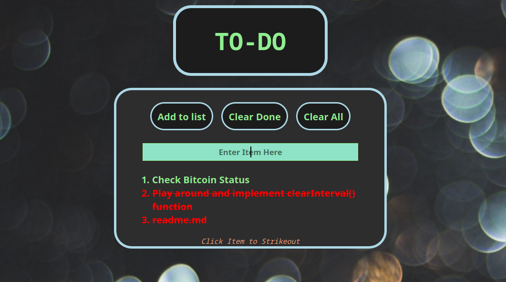

# To-Do App

> To-Do App written in Javascript, HTML & CSS

  

Check out the app [here](https://bbastanza.github.io/Todo-List/)

## Summary

I made this app to further my knowledge of JS, HTML and CSS.

Building this app I learned about a lot about DOM manipulation, using local storage, how to impliment buttons in clear way and how to take inputs from users and impliment them into the HTML.

The biggest roadblock I encountered at the time was how to keep class changes in local storage. It was a welcomed challenge and finishing it the way I wanted to was very rewarding.

#

## Author

### Brian Bastanza- Full Stack Web Developer

[Personal Website](www.brianbastanza.com)

[LinkedIn](www.linkedin.com/in/brian-bastanza-9035397b)
